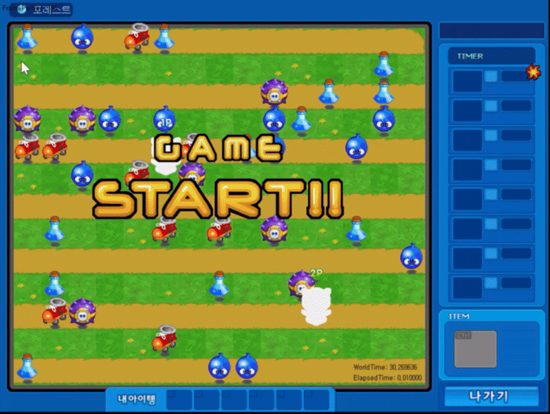
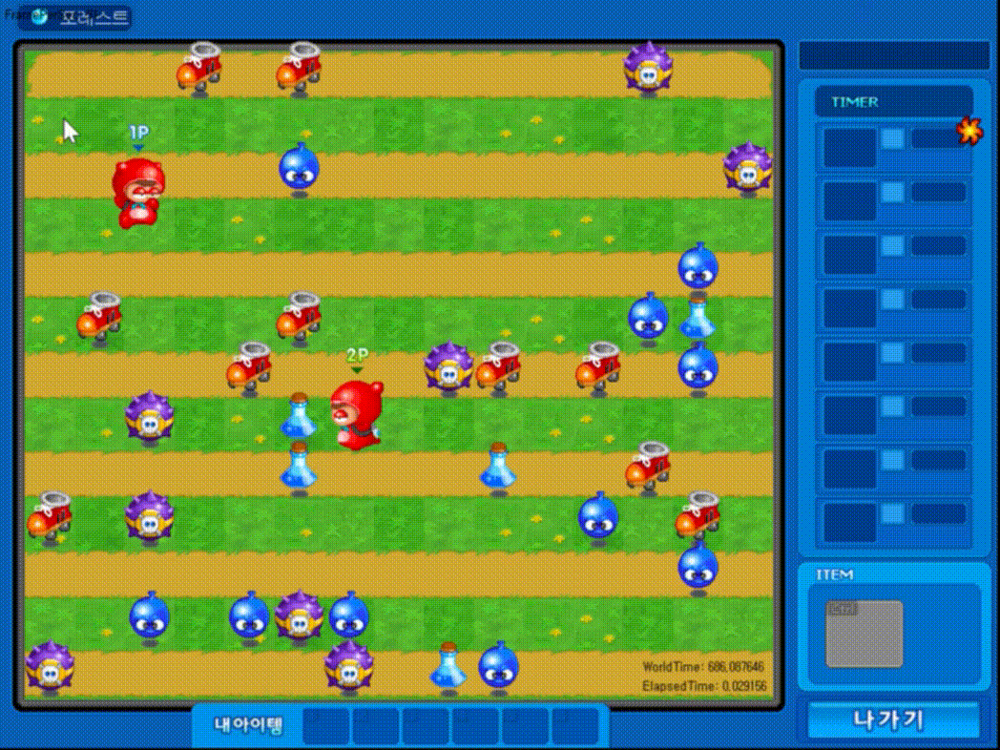

# CrazyArcade RL Agents (DQN & PPO)

크레이지아케이드 스타일의 1vs1 게임 환경에서  
DQN(Deep Q-Network)과 PPO(Proximal Policy Optimization) 기반 에이전트를 학습하는 프로젝트입니다.

C++로 구현된 게임 서버와 Python 강화학습 에이전트를 TCP 소켓으로 연결하여,

- 맵 탐색 및 아이템 수집
- 물풍선 설치 및 회피
- 상대를 물방울에 가두고 KO 시키는 전투

전략을 스스로 학습하도록 하는 것을 목표로 합니다.

[Episode10]
  
[Episode1000]
 
---

## 1. 폴더 구조

```text
CrazyArcade/
 ├─ 2weeks_project_ver2/      # C++ 게임 서버 프로젝트 (Visual Studio 솔루션)
 ├─ 2weeks_project_ver2.sln   # C++ 솔루션 파일
 ├─ fmod.dll                  # 사운드 라이브러리 DLL
 ├─ Screenshot/               # 스크린샷
 ├─ python_agent/             # Python 강화학습 에이전트 (강화학습 python 파일 모음)
 │   ├─ config.py             # 공통 설정(포트, 상태/행동 차원, 보상 상수 등)
 │   ├─ game_interface.py     # C++ 서버와 소켓 통신 + 상태/보상 계산
 │   ├─ dqn_agent.py          # DQN 에이전트 구현
 │   ├─ ppo_agent.py          # PPO 에이전트 구현
 │   ├─ train_dqn.py          # DQN 학습 스크립트 (Player 1)
 │   ├─ train_ppo.py          # PPO 학습 스크립트 (Player 2)
 │   ├─ train_self_play.py    # 셀프 플레이 실험용 스크립트
 │   ├─ play_agent.py         # 학습된 모델로 플레이
 │   ├─ models/               # 학습된 모델(.pth) 저장 위치
 │   └─ requirements.txt      # Python 의존성 목록
 └─ readme.md                 # README
```

---

## 2. 환경 요구사항

- OS: Windows / Linux (Python 에이전트는 OS 독립, C++ 서버는 현재 Windows 개발 환경 기준)
- Python: 3.11 이상 권장
- C++:
  - Visual Studio 2019/2022 (C++17 이상)
  - `2weeks_project_ver2.sln` 빌드 가능 환경

### 2.1 Python 패키지

`python_agent/requirements.txt` 참고:

```text
torch>=2.0.0
numpy>=1.24.0
matplotlib>=3.7.0
tensorboard>=2.13.0
```

추가로 기본적으로 필요한 패키지: `argparse`, `time`, `os` 등은 표준 라이브러리 사용.

---

## 3. 설치 방법

### 3.1 저장소 클론

```bash
git clone https://github.com/<YOUR_GITHUB_ID>/CrazyArcade.git
cd CrazyArcade/python_agent
```

### 3.2 Python 가상환경 생성

```bash
python -m venv .venv
source .venv/bin/activate    # Linux / macOS
# 또는
.venv\\Scripts\\activate       # Windows PowerShell
```

### 3.3 의존성 설치

```bash
pip install --upgrade pip
pip install -r requirements.txt
```

---

## 4. C++ 게임 서버 빌드 및 실행

> **중요**: Python 에이전트는 항상 "이미 실행 중인 게임 서버"에 TCP로 접속합니다.  
> 서버가 실행되지 않은 상태에서는 학습/플레이가 동작하지 않습니다.

1. Visual Studio에서 `2weeks_project_ver2.sln` 열기
2. 솔루션 빌드 (Debug 또는 Release)
3. 실행 (디버그 - 실행)
4. 게임 서버는 내부 설정에 따라
   - Player 1: 포트 `12345`
   - Player 2: 포트 `12346`  
   에서 TCP 연결을 기다리도록 구현되어 있으며,  
   Python 쪽 `config.py`/`game_interface.py`에서도 동일 포트를 사용합니다.

> 정확한 포트/옵션은 C++ 서버 코드 및 UI 설정에 따라 약간 다를 수 있으므로,  
> 필요 시 서버 쪽 옵션/코드를 참고해 주세요. (이 README에서는 기본 포트 기준으로 설명합니다.)

---

## 5. Python 에이전트 실행 방법

모든 명령은 `CrazyArcade/python_agent` 디렉토리에서 실행한다고 가정합니다.

### 5.1 DQN 학습 (Player 1)

```bash
cd CrazyArcade/python_agent

python train_dqn.py \
  --episodes 1000 \
  --port 12345 \
  --model ./models/dqn_episode_500.pth   # (선택) 이어서 학습
```

- `--episodes`: 학습 에피소드 수 (기본값 1000)
- `--port`: C++ 게임 서버 포트 (Player 1 기본값 12345)
- `--model`: 기존 모델 경로 (옵션, 없으면 새로 시작)

로그 예시:

- 에피소드별 보상/스텝 수
- 최근 10판 평균 보상/길이
- 누적 Win/Loss/Draw 및 승률
- ε-greedy에서 현재 ε 값, 메모리 크기 등

모델 저장:

- Episode 50 주기 `./models/dqn_episode_XXX.pth`로 저장
- 학습 종료 시 `./models/dqn_final.pth` 저장

### 5.2 PPO 학습 (Player 2)

```bash
cd CrazyArcade/python_agent

python train_ppo.py \
  --episodes 1000 \
  --port 12346 \
  --model ./models/ppo_episode_500.pth   # (선택) 이어서 학습
```

- `--episodes`: 학습 에피소드 수 (기본값 1000)
- `--port`: C++ 게임 서버 포트 (Player 2 기본값 12346)
- `--model`: 기존 모델 경로 (옵션)

로그 예시:

- 에피소드별 총 보상, 스텝 수
- 최근 10판 평균 보상/길이
- 누적 Win/Loss/Draw 및 승률
- PPO 손실 값, 메모리 크기 등  
- 학습 종료 시 `./models/ppo_final.pth` 저장

### 5.3 학습된 모델로 플레이

C++ 서버를 실행한 뒤, 아래 명령으로 에이전트만 플레이시킬 수 있습니다.

#### DQN 에이전트 플레이 (Player 1)

```bash
python play_agent.py \
  --agent dqn \
  --port 12345 \
  --episodes 5 \
  --model ./models/dqn_final.pth
```

#### PPO 에이전트 플레이 (Player 2)

```bash
python play_agent.py \
  --agent ppo \
  --port 12346 \
  --episodes 5 \
  --model ./models/ppo_final.pth
```

---

## 6. 상태, 행동, 보상 설계 요약

### 6.1 상태(state)

- 총 차원 수: `STATE_SIZE = 607`
- 구성:
  - **플레이어/적 센서 정보 (18차원)**  
    - 내/적 위치, 속도, 폭탄 개수, 파워, 생존 여부, 물방울에 갇혔는지 등
  - **맵 정보 (13×15×3 = 585차원)**  
    - 폭탄 위치 맵, 아이템 위치 맵, 물줄기 맵
  - **게임 메타 정보 (4차원)**  
    - 게임 시간, 게임 종료 플래그, 승자 ID, 내 ID

### 6.2 행동(action)

- `ACTION_SIZE = 6`
- 0: IDLE (제자리 정지)
- 1: UP  
- 2: DOWN  
- 3: LEFT  
- 4: RIGHT  
- 5: PLACE_BOMB (물풍선 설치)

### 6.3 보상(reward) 핵심 아이디어

- **승리/패배**
  - 승리: `+300`
  - 패배: `-300`
  - 무승부: 0 (결과만 기록)
- **공격/전투 관련**
  - 상대를 물방울에 가두기: `+50`
  - 갇힌 적을 터뜨리기: `+200`
  - 자동 KO 등: 추가 보상
- **피해/위험 관련**
  - 내가 물방울에 갇힘/터짐/자폭: 큰 마이너스 보상
  - 위험 존(폭탄/물줄기 근처)에 오래 머무름: 패널티
- **이동/아이템 관련**
  - 적에게 접근, 아이템 방향으로 이동: 소량의 플러스 보상
  - IDLE/연속 IDLE, 의미 없는 폭탄 난사, 벽에 계속 부딪힘 등: 패널티

이렇게 해서 "이기면 대체로 양의 누적 보상, 지면 음의 누적 보상"이 나오도록  
스케일을 조정했습니다.

---

## 7. 알고리즘 개요 (DQN vs PPO)

### 7.1 DQN (Deep Q-Network, Player 1)

- **Value-based, Off-policy**
  - `Q(s,a)`를 신경망으로 근사
  - Replay Buffer와 타깃 네트워크 사용
- **탐색 방법**
  - ε-greedy
    - 확률 ε: 랜덤 행동
    - 확률 1−ε: `argmax_a Q(s,a)`
  - ε를 서서히 줄이되 0까지 떨어뜨리지 않으면,  
    학습 후에도 일정 수준의 탐색이 계속 유지됨
- **특징**
  - 데이터 재사용이 가능해 샘플 효율이 좋음
  - 여러 행동의 Q값이 비슷하면 특정 액션에 완전히 고정되기보다는  
    어느 정도 다양한 행동이 섞여 나오는 경향

### 7.2 PPO (Proximal Policy Optimization, Player 2)

- **Policy-based, Actor-Critic, On-policy**
  - Actor: `π(a|s)` 정책 분포를 직접 출력 (Softmax)
  - Critic: V(s) 상태 가치 함수
  - 클리핑된 객체함수로 안정적인 정책 업데이트
- **탐색 방법**
  - 학습 중: `Categorical(π(a|s))`에서 샘플링 (확률적 행동)
  - 엔트로피 보상으로 분포가 한쪽으로만 몰리지 않도록 유도
  - 평가/플레이 시: `argmax_a π(a|s)` (결정론적)
- **특징**
  - 정책 분포 자체를 학습하기 때문에  
    특정 행동(예: IDLE)이 "당장 안전해 보이는 선택"으로 인식되면  
    분포가 그쪽으로 쏠려 평가 단계에서 **그 행동만 반복**하는 현상이 나타날 수 있음

---

## 8. 관찰 결과 및 프로젝트 한계

- DQN/PPO 모두 **"상대를 정교하게 KO하는 플레이"**까지는 충분히 학습하지 못했고,
  - 서로 공격하기보다는
  - 맵을 돌아다니다가
  - 자기 폭탄/물줄기에 맞아 죽는 경우가 더 자주 발생했습니다.
- PPO는 특히,
  - 평가 시 `argmax`만 사용하기 때문에
  - 특정 상태에서 IDLE 등 한 가지 행동의 확률이 조금만 더 높아져도  
    실제 플레이에서는 거의 그 행동만 반복하는 패턴이 보였습니다.
- 승/패 판정 로직과 로그 집계는 수정되어,
  - 1vs1 게임에서 한쪽이 승이면 다른 한쪽은 패,
  - 무승부는 양쪽 모두 draw 로 일관되게 기록됩니다.

---

## 9. 기타

- 코드/구현상 버그나 개선 아이디어가 있으면 Issue 또는 PR로 피드백 환영합니다.
- RL, DQN, PPO에 대한 이론적인 설명은 별도의 보고서에 좀 더 자세히 정리되어 있으며,  
  이 README는 **실행·구조 이해 + 대략적인 알고리즘 개요** 수준으로 작성되었습니다.

---

## Thanks to

본 프로젝트의 C++ 게임 환경은 GitHub 사용자 `h3llowoori`님의
[CrazyArcade](https://github.com/h3llowoori/CrazyArcade) 프로젝트를 포크하여
수정·확장한 것입니다. 프로젝트를 공개해주신 원 저자께 감사드립니다.

* 원본 프로젝트는 현재 별도의 라이선스가 명시돼 있지 않으며, 저작권은 원 저자에게 있습니다. 만약 사용에 대해 문제가 될 경우 요청 시 관련 코드를 즉시 제거하겠습니다.
* 문의: koto144@gmail.com